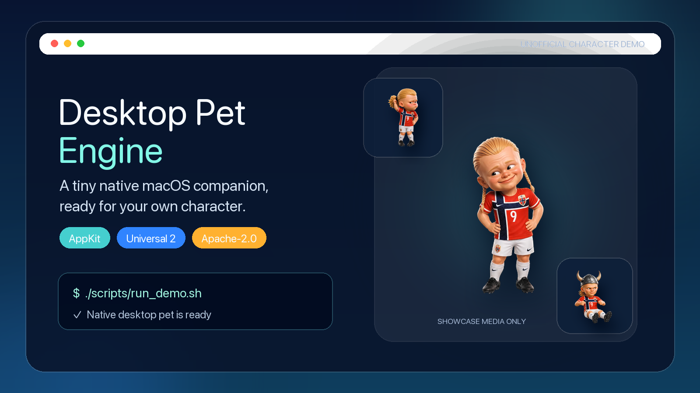
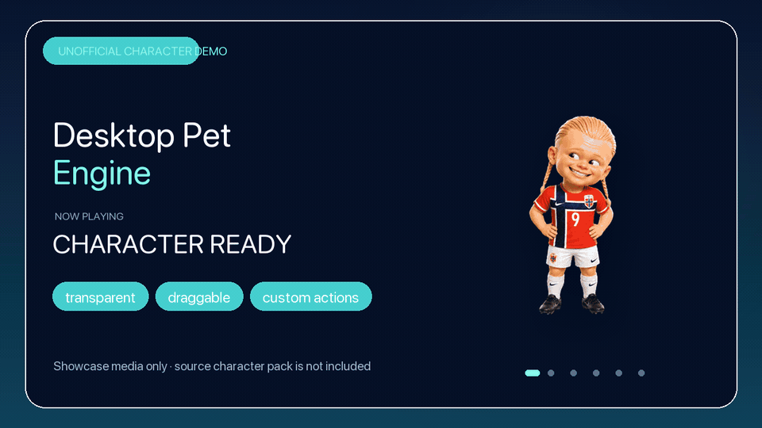
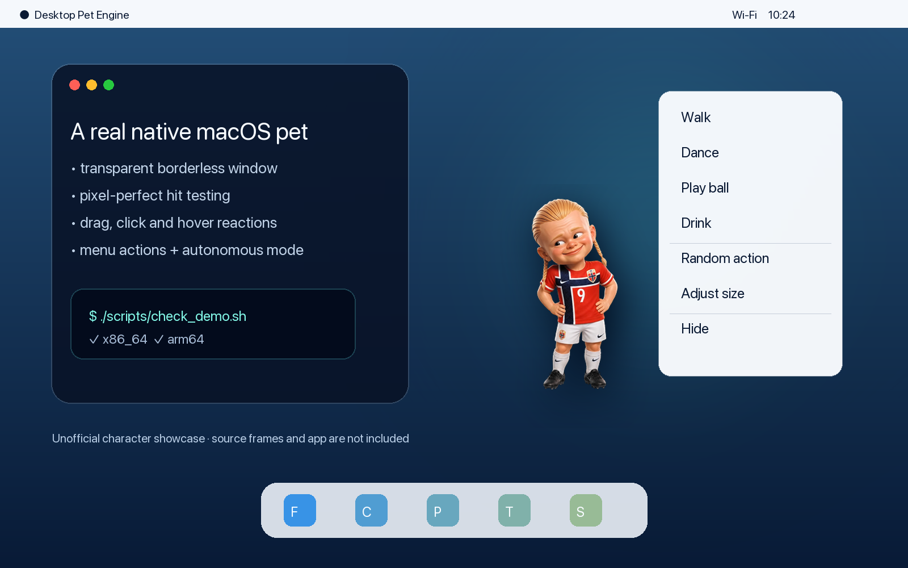
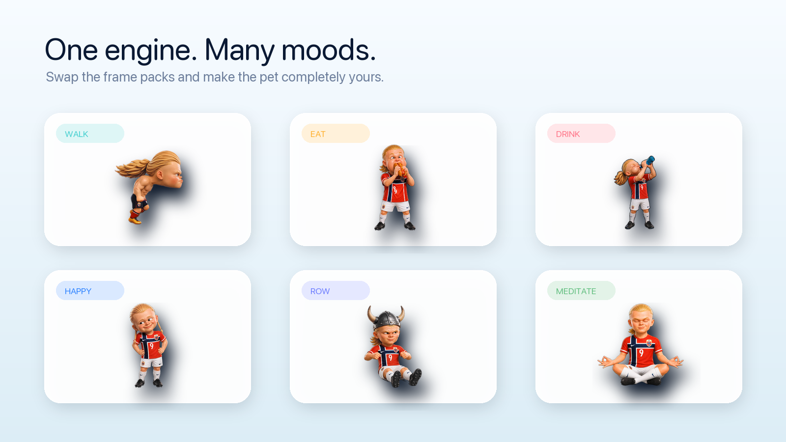

<div align="center">
  

  <h1>Desktop Pet Engine for macOS</h1>

  <p>Turn your own character and action assets into a native pet that truly lives on the macOS desktop.</p>

  <p><strong>English</strong> · <a href="README.zh-CN.md">简体中文</a></p>

  <p>
    <a href="https://github.com/InsiderX-Pro/desktop-pet-engine/releases/tag/habao-showcase-v1.7.0-preview">
      
    </a>
  </p>

  <p><sub>macOS 12+ · Apple Silicon &amp; Intel · Unnotarized preview</sub></p>

  <p>
    
    
    
    
    <a href="https://github.com/InsiderX-Pro/desktop-pet-engine/releases/tag/v1.1.0"></a>
    
  </p>
</div>

## See it in action

<div align="center">
  
</div>

<p align="center">
  <a href="docs/media/demo.mp4">Open the 8-second HD MP4 demo</a>
</p>

> The character shown on this page comes from a separately maintained, unofficial character demo and is included only to demonstrate the engine. Its source frames, source videos, prompts, app bundle, and private project are not published. These promotional renders are not covered by the Apache-2.0 license and do not imply authorization, affiliation, cooperation, or endorsement by any person, team, brand, or other rights holder. See the [media boundary notes](docs/media/README.md).

## More than an animated sticker

This is a lightweight native AppKit desktop-pet engine. It provides a transparent borderless window, per-pixel hit testing, drag interaction, cursor-aware idle poses, hover reactions, a contextual action menu, and an autonomous action state machine. Transparent regions of the pet window pass pointer events through to the desktop whenever possible.

| Capability | Included |
| --- | --- |
| Native desktop experience | Transparent always-on-top AppKit window, with no Electron dependency |
| Precise interaction | Alpha-aware hit testing and click-through based on the current animation frame |
| Configurable cursor themes | Optional Mousecape-compatible themes with persistence and per-action switching |
| Behavior system | Idle, manual, random, and autonomous actions with interruption recovery |
| Asset pipeline | Alpha detection, black/green-screen removal, normalized canvas, and PNG frame-pack generation |
| Reproducible builds | One-command build and validation for an x86_64 + arm64 Universal 2 app |
| Agent workflow | An installable Codex skill for building and auditing desktop pets |

## Mouse interaction

Move the pointer around the pet and it responds to the cursor's position and motion. In this demo, the character tracks, reaches for, catches, and plays with the pointer instead of simply looping a fixed animation.

<div align="center">
  
</div>

The engine also uses per-pixel alpha hit testing: dragging and the contextual action menu apply to the visible character, while transparent areas of the pet window pass pointer events through whenever possible.

Version 1.1 adds optional, configuration-driven system cursor themes. Users can select a base cursor and let pet actions switch themes automatically. The open-source repository ships only a generator for original Blob demo cursors; it does not publish the private showcase cursor artwork or bundle Mousecape. See the bilingual [cursor theme guide](docs/cursor-themes.md) for setup and the separate dependency/license boundary.

<div align="center">
  
</div>

## Run it in two commands

Requirements: macOS 12 or later and Xcode Command Line Tools.

```bash
git clone https://github.com/InsiderX-Pro/desktop-pet-engine.git
cd desktop-pet-engine
./scripts/check_demo.sh
./scripts/run_demo.sh
```

The resulting app is written to `dist/桌宠引擎.app`. Local builds use ad-hoc signing. Before distributing a binary release, sign it with your own Developer ID and complete Apple notarization.

## Bring your own character

1. Copy `assets_config.example.json` to `assets_config.json`.
2. Add transparent videos—or clean black/green-background videos—that you have the right to use.
3. Install FFmpeg, generate the frame pack, and run the checks:

```bash
./scripts/preprocess_assets.py
./scripts/check_demo.sh
```

The preprocessing script checks the codec and alpha channel, removes a solid background when needed, fits the character proportionally into a consistent 360×360 transparent canvas, and writes `manifest.json`. The app discovers the generated assets at launch, so actions do not need to be hard-coded into the player.

<div align="center">
  
</div>

The repository's built-in Blob demo pet is generated programmatically by `scripts/generate_demo_assets.py` and can be recreated at any time:

```bash
python3 -m pip install pillow
./scripts/generate_demo_assets.py
```

## Project structure

```text
Sources/DesktopPetEngine/  AppKit engine and open-source Blob frame pack
scripts/                   Asset generation, preprocessing, build, media, and validation tools
packaging/                 macOS app bundle metadata
docs/media/                Homepage images, GIF, MP4, and media boundary notes
assets_config.example.json Local asset configuration template
cursor_themes.example.json Local cursor theme configuration template
skill/                     Installable Codex desktop-pet skill
```

## Install the Codex skill

The repository includes the `build-macos-desktop-pet` skill. It can create a project from a clean template, process action assets, build a universal app, and scan a release for local paths, signing links, credentials, and configured restricted names.

```bash
cp -R skill/build-macos-desktop-pet ~/.codex/skills/
```

After installation, ask Codex:

```text
Use $build-macos-desktop-pet to turn my licensed transparent action videos into a macOS desktop pet.
```

## Assets and rights

- Commit only visual, audio, and character assets that you created or are explicitly licensed to redistribute.
- AI generation does not automatically resolve rights associated with a real person's name, likeness, or voice, or with team marks, uniforms, trademarks, and protected characters.
- Record the source, author, permitted uses, and license for every asset pack you add.
- The character renders on this page demonstrate the engine only. They do not indicate that the underlying character assets are open source and should not be extracted or redistributed as an asset pack.

## License

The engine code, scripts, skill, and Blob example assets generated by `generate_demo_assets.py` are licensed under the Apache License 2.0.

`docs/media/hero.png`, `desktop-preview.png`, `action-grid.png`, `demo.gif`, `demo.mp4`, and `mouse-interaction.gif` are separately identified character showcase media and are expressly excluded from the Apache-2.0 license. User-imported assets retain their original rights status.

See [LICENSE](LICENSE), [NOTICE](NOTICE), [THIRD_PARTY_NOTICES.md](THIRD_PARTY_NOTICES.md), and the [contribution guide](CONTRIBUTING.md).
